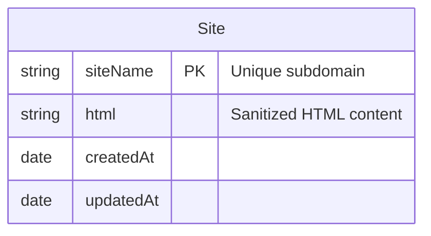

# brixi

AI-powered website builder that generates complete HTML pages based on simple text descriptions. No coding, no drag-and-drop — just type what you need, and get a ready-to-use web page

## Backend Overview

This backend powers the Brixi AI Website Builder. It receives user input, validates and sanitizes it, generates a landing page using Google Generative AI, uploads the HTML to a CDN, and stores site metadata in MongoDB.

---

## Getting Started

### 1. Clone the repository

```sh
git clone https://github.com/adelsrour/brixi.git
cd brixi/apps/backend
```

### 2. Install dependencies

```sh
npm install
```

### 3. Configure environment variables

Create `.env` and fill in your values:

```env
MONGODB_URI=mongodb://localhost:27017/brixi
GEMINI_API_KEY=your_google_gemini_api_key
CDN_UPLOAD_URL=https://yourCDN.com/endpoint
CDN_SECRET_KEY=your_cdn_secret_key
CDN_DOMAIN=yourCDNDomain.com
PORT=3000
```

| Variable         | Required | Description                                                  |
| ---------------- | -------- | ------------------------------------------------------------ |
| `MONGODB_URI`    | Yes      | MongoDB connection string                                    |
| `GEMINI_API_KEY` | Yes      | Google Generative AI API key                                 |
| `CDN_UPLOAD_URL` | Yes      | URL to upload HTML files to CDN                              |
| `CDN_SECRET_KEY` | Yes      | Secret key for authenticating CDN uploads                    |
| `CDN_DOMAIN`     | Yes      | The domain used for serving user sites (e.g. brixi.adel.dev) |
| `PORT`           | No       | Port to run the backend server (default: 3000)               |

### 4. Start the server

```sh
npm run start
```

The API will be available at `http://localhost:3000/api/v1/sitebuilder`.

---

## Endpoint Structure

### `POST /api/v1/sitebuilder`

**Description:**  
Generates a single-page website based on user input, uploads it to the CDN, and stores the site in MongoDB.

**Request Body (JSON):**

| Field       | Type   | Description                                                                                |
| ----------- | ------ | ------------------------------------------------------------------------------------------ |
| prompt      | string | User's prompt for the AI (10-200 chars, no special chars except comma)                     |
| phoneNumber | string | Valid international phone number (E.164 format)                                            |
| brandName   | string | Brand or site name (min 5 chars, no special chars)                                         |
| color       | string | Color name, hex code, or comma-separated RGB (validated by regex)                          |
| address     | string | Address (min 10 chars, allows letters, numbers, spaces, comma, period, apostrophe, hyphen) |
| siteName    | string | Subdomain (3-20 chars, lowercase letters and numbers only, unique)                         |

**Example Request:**

```json
{
  "prompt": "Create a modern landing page for a tech startup, clean and minimal.",
  "phoneNumber": "+1234567890",
  "brandName": "TechNova",
  "color": "#3498db",
  "address": "123 Main St, San Francisco, CA",
  "siteName": "technova"
}
```

**Example Success Response:**

```json
{
  "status": true,
  "url": "https://technova-yourCDN.com",
  "message": "Your website has been created"
}
```

**Example Error Response:**

```json
{
  "statusCode": 400,
  "message": "This subdomain is already taken, please choose another subdomain.",
  "error": "Bad Request"
}
```

---

## Endpoint Flow

1. **Validation & Sanitization:**  
   All fields are validated using DTOs and sanitized to prevent XSS and MongoDB injection.
2. **AI Generation:**  
   The prompt and user details are sent to Google Generative AI to generate HTML.
3. **HTML Sanitization:**  
   The generated HTML is sanitized to allow all tags and attributes but strips MongoDB injection patterns.
4. **CDN Upload:**  
   The HTML is uploaded as a file to the CDN via a secure endpoint.
5. **MongoDB Storage:**  
   If CDN upload is successful, the site HTML and metadata are stored in the `sites` collection.

---

## MongoDB ERD



- **Collection:** `sites`
- **Unique Index:** `siteName`

---

## Middlewares Used

- **Helmet:**  
  Sets HTTP headers for security (prevents common web vulnerabilities).
- **Rate Limit Middleware:**  
  Limits the number of requests per IP to prevent abuse and DoS attacks.
- **XSS Clean Middleware:**  
  (Optional) Sanitizes user input to prevent XSS attacks.
- **Error Handler Middleware:**  
  Catches and formats all errors, returning consistent error responses.
- **ValidationPipe:**  
  Globally validates and transforms incoming requests using DTOs.

**Why?**  
These middlewares are used to protect the API from common attacks (XSS, DoS, HTTP header exploits), ensure data integrity, and provide clear error handling for clients.

---

## Security Notes

- All user input is validated and sanitized.
- Only sanitized HTML is stored and served.
- Subdomain (`siteName`) is unique and strictly validated.
- CDN uploads require a secret key for authentication.

---

## Frontend env

```env
NEXT_PUBLIC_SITEBUILDER_URL=https://APILINK.com/
NEXT_PUBLIC_SITEBUILDER_SUBDOMAIN=domainName
```

## Contribution

Feel free to open issues or PRs for improvements or bug fixes.

---
